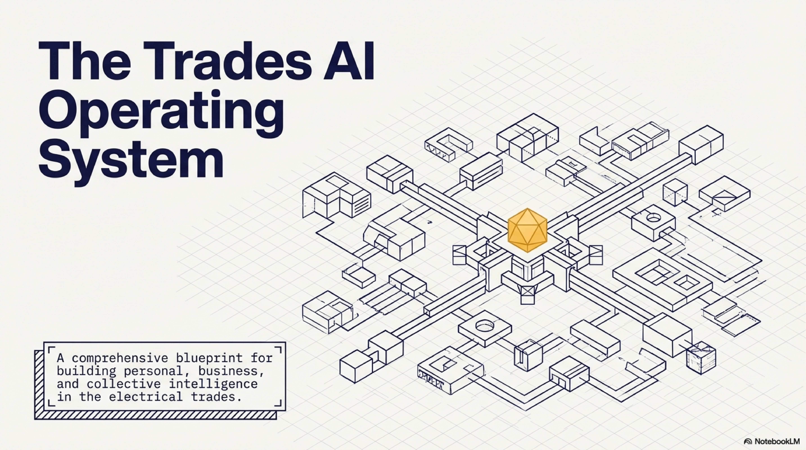

# AI Vision for the Electrical Business

**A practical roadmap for building AI into the daily operations of a trades business, from personal assistant to business brain to collective intelligence.**

*All great things start with a conversation.*

<audio controls>
  <source src="Josh-and-chris-convo_11.03.26.mp3" type="audio/mpeg">
</audio>

 

[PDF](The_Trades_AI_OS_(2).pdf)

---

## 1. The Problem

Running a trades business means constant context switching. Taking calls, dispatching teams, chasing invoices, checking compliance, managing vehicles, quoting jobs, solving problems on site. The administrative overhead eats into the time that actually matters: doing good work, building relationships with customers, and looking after your people.

Most of this overhead isn't complex. It's just relentless. Remembering things, finding things, chasing things, checking things. The kind of work that doesn't need a human brain but currently has no alternative.

AI changes that. Not by replacing people, but by giving every person in the business a capable, always-available working companion.

---

## 2. Design Principles

These principles hold across every layer of the system.

**Human-initiated input.** The person always starts the interaction. No passive surveillance. No always-on recording. You press the button, you start the conversation, you decide what gets captured.

**Proactive output.** Once you've given the system information, it earns its keep by prompting you at the right time. It doesn't wait to be asked. It nudges, reminds, flags, and surfaces what matters when it matters.

**Voice-first interaction.** Tradies aren't sitting at desks. The primary interface is spoken conversation. Typing is a fallback for when precision matters or voice isn't practical.

**Operator-controlled privacy.** Every person controls what their agent stores, what it shares, and what it forgets. Consent is explicit and revocable. Nothing is recorded unless you deliberately choose to record it.

**Stepping stones, not big bangs.** Start with a personal agent. Prove the value. Then connect the dots. Trust is earned incrementally.

---

## 3. Layer One: The Personal Agent

### What It Is

A voice-first AI assistant that acts as your working memory. You talk to it like a colleague. It captures what you tell it, organises it, and feeds it back to you when you need it.

### Core Capabilities

#### Job Capture and Context Building

When you take a call or receive a job, you talk to your agent immediately after. You tell it what you know: the customer, the address, what they described, any quirks or history. The agent structures this into a job record and asks clarifying questions if something is missing.

If you can feed it supporting documents (photos, plans, specs, previous job files), it incorporates those into its understanding. Over time it builds a rich context for every job, not just a line item in a scheduling system.

#### Schedule and Priority Management

You tell your agent your tasks for the day and their relative priority. It holds that structure for you and actively manages your attention:

- Prompts you when it's time to shift focus
- Warns you when a deadline is approaching
- Notices when you've drifted off-task (picked up your phone, gone down a rabbit hole) and gently redirects
- Adjusts dynamically as new priorities come in during the day

This isn't a calendar. It's a coach that knows what you said you wanted to achieve and holds you accountable to it.

#### On-Site Fault Finding and Technical Support

When you're on a job and you hit a problem, you describe the situation to your agent: the voltages you're reading, the circuit layout, what you've tested so far. The agent can:

- Suggest likely fault locations based on the symptoms
- Look up product specifications and datasheets
- Reference relevant regulations and standards
- Search your own job history for similar situations and how they were resolved

This is the beginning of a personal knowledge base that grows with every job you do.

#### Daily Briefing and Wrap-Up

Start of day: the agent gives you a rundown of what's on, what's due, what needs attention. End of day: you debrief with it. What got done, what didn't, what needs to carry over. This creates a continuous thread of accountability without paperwork.

### How You Interact With It

The primary mode is voice. You talk, it listens, it responds. For situations where precision matters or you need to review structured information, you can switch to text. The agent adapts to your communication style over time.

The key constraint: you always initiate. The agent doesn't listen until you tell it to. When you're done, it stops. What gets stored is what you explicitly chose to share.

---

## 4. Layer Two: The Business Brain

### What It Is

The personal agent handles the human interface. The business brain handles the systems interface. It connects to your existing business tools (Simpro, Laser Pro, Xero, fleet management, email) and acts as an intelligent layer across all of them.

### Core Capabilities

#### Financial Monitoring and Anomaly Detection

You set the rules. The agent enforces them continuously.

- **Gross profit tracking:** Flag every job that falls below your target margin (say 15% or 20%). For each flagged job, pull the details: was it an hours blowout, a materials overbuy, a pricing error? Present the information so you can make a decision, not so you have to go hunting.
- **Pricing surveillance:** When an invoice comes in that looks high, the agent searches your history for previous invoices from that supplier for the same or similar items. It shows you the price trajectory and highlights any jumps.
- **Supplier comparison:** Over time, build a picture of which suppliers are competitive on which materials. Surface this at quoting time, not as an afterthought.

#### Operational Compliance and Fleet Management

The mundane stuff that causes real pain when it slips through the cracks.

- Track vehicle registration, WOF/COF dates, and service intervals for every vehicle in the fleet
- Track tool calibration dates, electrical testing certification, and site induction renewals
- Send automated reminders at appropriate lead times
- For routine actions (booking a vehicle service), send pre-approved templated communications on your behalf. "This vehicle is due for a service on [date]. Please confirm a booking."

#### Job Cost Analysis and Reporting

Rather than running reports manually at month end, the business brain continuously analyses job data and surfaces insights:

- Which job types are most and least profitable?
- Where are the recurring cost blowouts?
- Which customers are growing, shrinking, or becoming unprofitable?
- Are material return rates increasing for certain suppliers?

The goal is to turn your job management system from a record-keeping tool into a decision-support tool.

#### Resource and Staffing Intelligence

When work volume changes quickly (as it does), the agent helps you see the picture:

- Current team utilisation and availability
- Upcoming job commitments versus capacity
- Skills matching: who is qualified and experienced for what type of work
- Early warning when you're about to be over- or under-resourced

---

## 5. Layer Three: The Hive Mind

### What It Is

This is the future state. Personal agents across the team begin to share knowledge (with explicit consent), creating a collective intelligence that no individual could maintain alone.

### How It Works

Each person's agent holds their professional history: jobs they've worked, problems they've solved, techniques they've developed, mistakes they've learned from. When the hive mind is active, agents can query each other's knowledge bases.

**Example scenario:** A sparky is on site dealing with an unusual fault in a switchboard. Their agent searches the team's collective history and finds that a colleague dealt with a near-identical situation eighteen months ago. It surfaces that job record, the approach taken, and the resolution. The sparky on site now has an extra option to explore that they wouldn't have had otherwise.

Over a 10 to 15 year lifespan, this becomes an extraordinary asset. The collective experience of every person who has ever worked in the business, structured, searchable, and growing every day.

### Privacy and Consent

This layer requires the most careful handling.

- Every person explicitly opts in to what their agent shares
- Certain categories of information can be marked as private by default
- The system logs what was shared and with whom
- Anyone can revoke sharing permissions at any time
- The focus is on professional knowledge (job history, technical solutions), not personal information

### Realistic Expectations

This won't work perfectly at first. There will be irrelevant matches, false connections, and frustration. But the baseline is still valuable: even if the hive mind suggestions miss the mark, every person still has their own agent capturing and organising their work. The collective layer is additive, not essential.

---

## 6. What This Makes Possible

### For the Individual

- Less time spent on admin, more time spent on skilled work
- A growing personal knowledge base that makes you better at your job every year
- Fewer things falling through the cracks
- Less cognitive load from trying to hold everything in your head

### For the Business

- Tighter cost control without micromanagement
- Faster identification of problems (pricing, margins, compliance gaps)
- Better resource allocation during demand spikes
- Institutional knowledge that doesn't walk out the door when someone leaves

### For Customers

This is where it gets interesting. If the business becomes materially more efficient, that creates a choice. You can pocket the savings, or you can pass them on.

Josh's vision is to pass them on. Set a defined income target for the business (what it needs to earn to pay everyone well and cover all expenses), then use the efficiency gains to lower rates for customers. Not to undercut competitors, but because the customer shouldn't have to pay for inefficiency.

### For the Community

Beyond competitive pricing, the efficiency dividend opens up capacity for social good. If the business is making what it needs and the team has more breathing room, there's space to:

- Contribute skilled labour to community projects
- Mentor young tradies coming through
- Invest in local initiatives that matter to the team
- Operate from a values-based model rather than a pure profit motive

The thesis is simple: tighten the waste, free the people, share the surplus.

---

## 7. Getting Started

The roadmap follows the stepping stones principle.

**Step 1: Personal agent for the business owner.** Start with Josh. Voice-first capture of jobs, tasks, and decisions. Schedule management and daily prompting. Prove the concept on one person before scaling.

**Step 2: Connect to one business system.** Link the personal agent to the job management or invoicing system. Start with a single high-value use case: flagging low-margin jobs, or tracking supplier pricing.

**Step 3: Roll out personal agents to the team.** Once the interaction model is proven, give every team member their own agent. Focus on job capture and on-site technical support.

**Step 4: Build the business brain.** Connect across multiple systems. Automate compliance monitoring, fleet management, and financial reporting.

**Step 5: Pilot the hive mind.** With a team of agents generating structured knowledge, begin testing cross-agent search and recommendation. Start small, iterate based on what's actually useful.

---

*This is not a technology project. It's an operating model change that happens to use technology. The AI is the enabler. The goal is a business that runs efficiently enough to be generous.*
